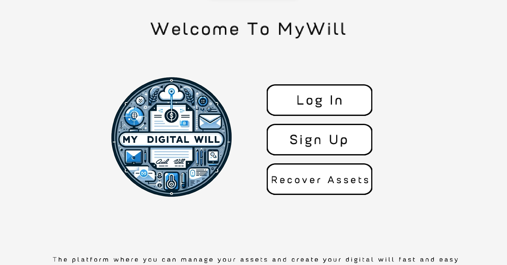
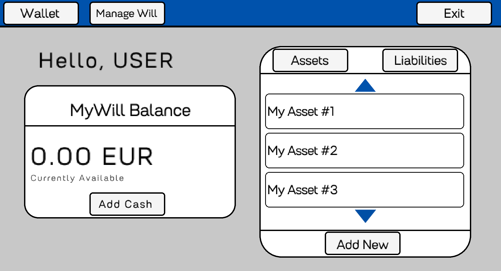

<div align="center"> </div>

##  About
<p>
   Our idea is to create a platform where you can manage your assets and create your digital will fast and easy.  
</p>

##  Demo of our project
<div align = "center">
  
  
</div>

##  Installing
You can install our project by using this link:
```
   https://github.com/INNedkova21/team_alpha.git
```

##    Team members
| Iva Nedkova  | Bozhidar Dukov | Todor Ivanov | Boris Belberov |
| :---: | :---: | :---: | :---: |
| [INNedkova21](https://github.com/INNedkova21)  | [BNDukov21](https://github.com/BNDukovXXI) | [TPIvanov21](https://github.com/TPIvanov21) | [BRBelberov21](https://github.com/BRBelberov21)  |
| Scrum Trainer | Back-end Developer | Back-end Developer | Designer |


##  Used technologies
-   C++
-  C
-   Visual studio
-   Git Hub
-   Git
-   Power point
-   Word
-   Excel
-   Figma
-   Raylib

<div align = "center">
   <p>
      If you like our project, you can rate us by giving us a 
   </p>
   <p>
      Thanks! 
   </p>
</div>
